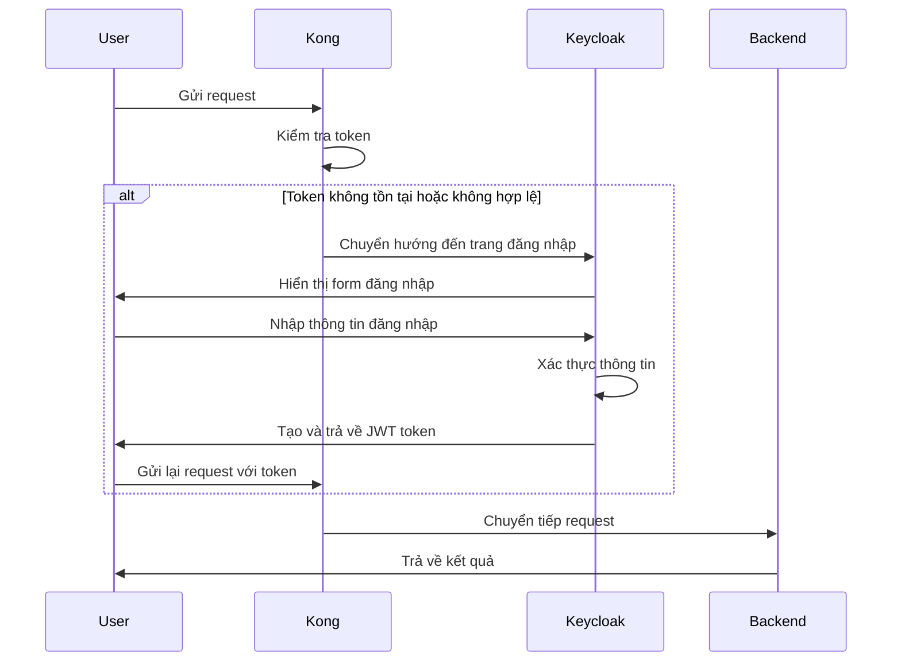
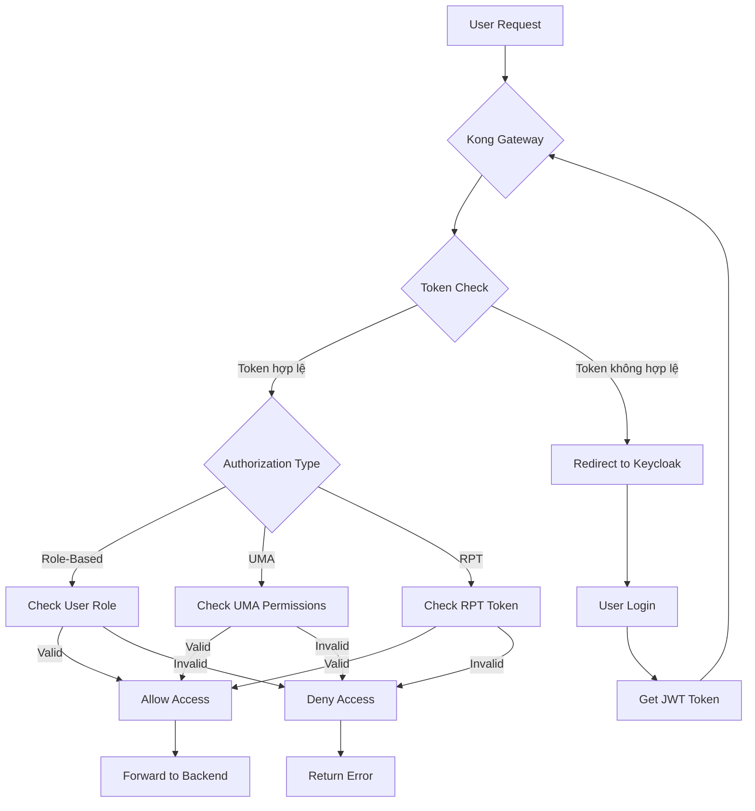
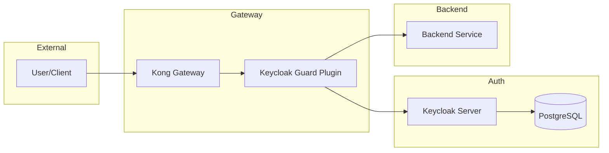
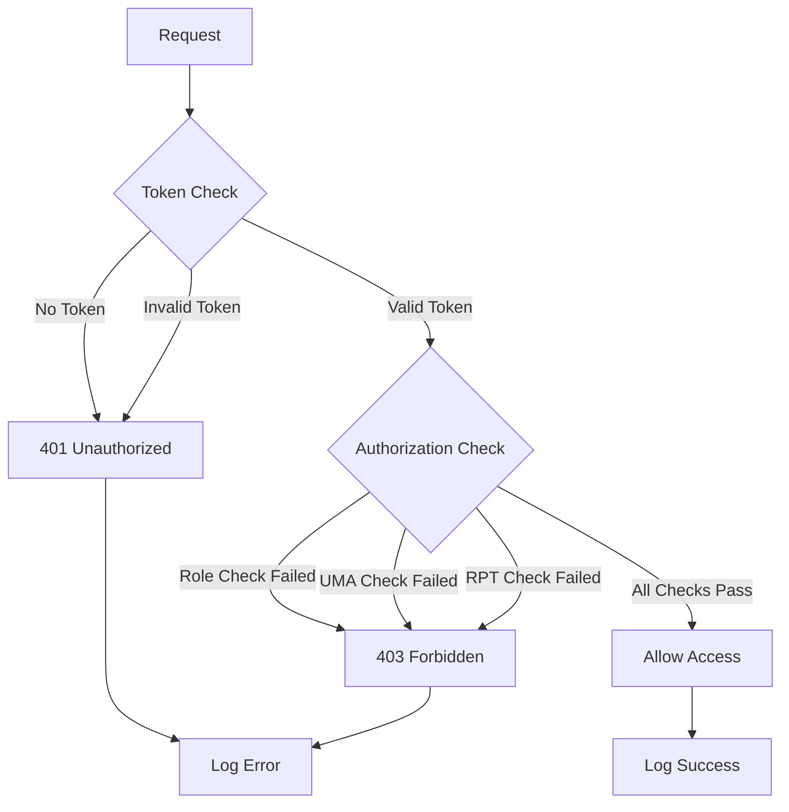
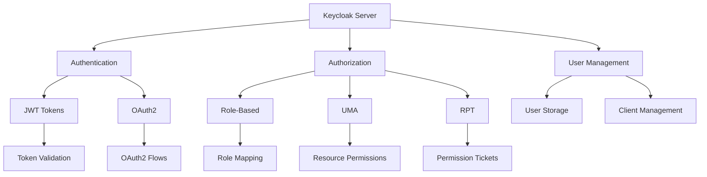

# Sơ đồ luồng hoạt động của hệ thống

## 1. Luồng xác thực cơ bản

```mermaid
sequenceDiagram
    participant User
    participant Kong
    participant Keycloak
    participant Backend

    User->>Kong: Gửi request
    Kong->>Kong: Kiểm tra token
    alt Token không tồn tại hoặc không hợp lệ
        Kong->>Keycloak: Chuyển hướng đến trang đăng nhập
        Keycloak->>User: Hiển thị form đăng nhập
        User->>Keycloak: Nhập thông tin đăng nhập
        Keycloak->>Keycloak: Xác thực thông tin
        Keycloak->>User: Tạo và trả về JWT token
        User->>Kong: Gửi lại request với token
    end
    Kong->>Backend: Chuyển tiếp request
    Backend->>User: Trả về kết quả
```

## 2. Quá trình xác thực nâng cao

```mermaid
graph TD
    A[User Request] --> B{Kong Gateway}
    B --> C{Token Check}
    C -->|Token hợp lệ| D{Authorization Type}
    C -->|Token không hợp lệ| E[Redirect to Keycloak]
    E --> F[User Login]
    F --> G[Get JWT Token]
    G --> B
    
    D -->|Role-Based| H[Check User Role]
    D -->|UMA| I[Check UMA Permissions]
    D -->|RPT| J[Check RPT Token]
    
    H -->|Valid| K[Allow Access]
    H -->|Invalid| L[Deny Access]
    I -->|Valid| K
    I -->|Invalid| L
    J -->|Valid| K
    J -->|Invalid| L
    
    K --> M[Forward to Backend]
    L --> N[Return Error]
```

## 3. Kiến trúc hệ thống

```mermaid
graph LR
    subgraph External
        User[User/Client]
    end
    
    subgraph Gateway
        Kong[Kong Gateway]
        Plugin[Keycloak Guard Plugin]
    end
    
    subgraph Auth
        Keycloak[Keycloak Server]
        DB[(PostgreSQL)]
    end
    
    subgraph Backend
        Service[Backend Service]
    end
    
    User --> Kong
    Kong --> Plugin
    Plugin --> Keycloak
    Keycloak --> DB
    Plugin --> Service
```

## 4. Luồng xử lý lỗi

```mermaid
graph TD
    A[Request] --> B{Token Check}
    B -->|No Token| C[401 Unauthorized]
    B -->|Invalid Token| C
    B -->|Valid Token| D{Authorization Check}
    D -->|Role Check Failed| E[403 Forbidden]
    D -->|UMA Check Failed| E
    D -->|RPT Check Failed| E
    D -->|All Checks Pass| F[Allow Access]
    
    C --> G[Log Error]
    E --> G
    F --> H[Log Success]
```

## 5. Cấu hình Keycloak

```mermaid
graph TD
    A[Keycloak Server] --> B[Authentication]
    A --> C[Authorization]
    A --> D[User Management]
    
    B --> E[JWT Tokens]
    B --> F[OAuth2]
    
    C --> G[Role-Based]
    C --> H[UMA]
    C --> I[RPT]
    
    D --> J[User Storage]
    D --> K[Client Management]
    
    E --> L[Token Validation]
    F --> M[OAuth2 Flows]
    G --> N[Role Mapping]
    H --> O[Resource Permissions]
    I --> P[Permission Tickets]
``` 